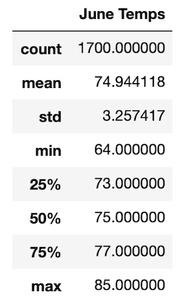
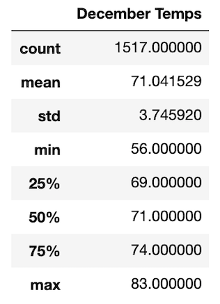
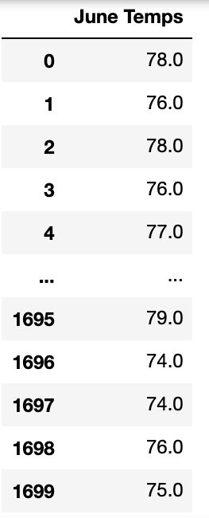
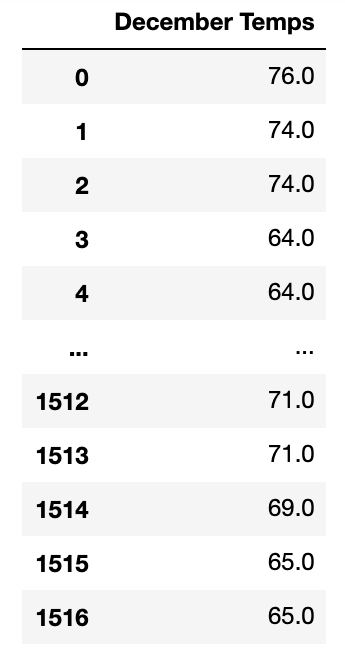

# Surfs_Up
Module 9

## Overview of Project
Love to surf and looking to transition into a passion driven career? We will take a look at one of the largest factors when creating a business in a seasonal location dependent on favorable weather. To open an ice cream and surf shop, success will need a combination of good weather and seasonal tourists. After collecting all of the temperature readings for June (top Summer seasonal month) and December (top Winter seasonal weather) we can evaluate if there will be more favorable conditions to maximize profits during the seasonal increase of potential customers that have traveled to Hawaii for its most popular hobby. 

Providing the Board of Elections with an audit of the tabulated results of the US Congressional precinct in Colorado. This analysis will provide Tom, a Board of Elections employee, with the following information (derived from the provided election data):
<li>Total votes casted</li>
<li>The County and their specific amount of votes</li>
<li>The largest county turnout</li>
<li>Each candidate, total candidate votes, and percentage of the candidates votes</li>
<li>The winning candidate of the popular vote, candidate's winning vote count, and winning percentage</li>

## Results

When evaluating the June and December summary of temperature collection, a few concussions can be derived: 
<li> The average temperature varies approximately 4 degrees showing that there are some favorable days throughout the year; with consistent average temperatures, the water temperature will stay more favorable as well. </li>

<li> The highest recorded temperature was 85 in June and 83 in December; again offering little variance in the two separate times of the year. The lowest recorded temperature is 64 in June and 56 in December; this is the largest variances in the temperature readings showing that December does have a higher probability of having unfavorable weather and drastic changes. </li>

<li> The standard deviation in June is 3.26 versus 3.75 in December. Both standard deviations provide good predictability using the collected temperatures. June is expected to have a lower deviation due to collecting almost 200 more samples (1700 in June and 1517 in December). 

|                       June                                |                               December                  |
| --------------------------------------------------------- | ----------------------------------------------------------------  |
|     |     |
|  |  |

## Summary

In summary, to determine if the weather is going to provide a favorable environment for an ice cream and surf shop; more analysis is required, especially requiring such a large investment. Recommendations include:

1. Stations - if there are additional stations that can collect temperatures so that a specificities are can become the main focus of the analysis. Including other stations on Oahu, if available would increase the collection locations. Additionally, looking at other islands inHawaii and collecting samples would allow an analysis to be evaluated to see if other items have more favorable weather and therefor; could attract more seasonal visitors. 

2. Year-round analysis - Conducting the same analysis throughout all 12 months will be able to provide research to adjust the business plan. This would be beneficial to see if other months will allow consistent weather predictions and when weather is most likely to force business plan revision to offer services or products that are less affected by rainy, cold days. 
